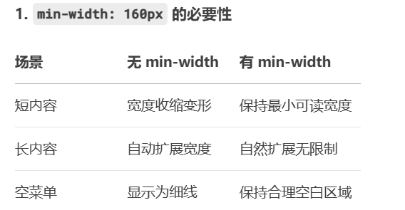
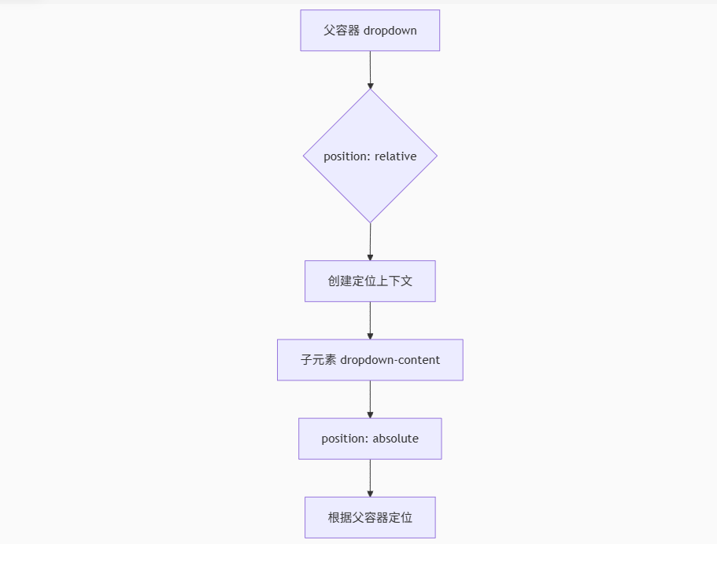
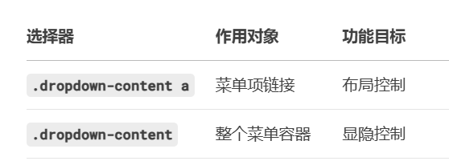

## 第一个问题：为什么右对齐的下拉菜单没有设置 style="right:0;"？

```
.dropdown-content {
  right: 0; /* 核心右对齐属性 */
  position: absolute;
}
```

未写内联样式的原因：CSS 类已包含 right:0，无需重复声明
与左对齐对比：

```
<!-- 左对齐需覆盖默认 right:0 所以会设置-->
<div class="dropdown-content" style="left:0">
```

## 为什么设置 min-width:160px;？

这是为了保证下拉菜单即使内容较少也有一个最小宽度，避免显得过窄，提升视觉效果和可用性。



## 为什么使用 position:absolute;？

绝对定位使下拉内容脱离文档流，相对于最近的定位父元素（即.dropdown）定位，这样下拉菜单可以精确地出现在按钮的下方，而不会影响其他元素的布局。 2. position: absolute 的作用机制



脱离文档流：避免挤压其他元素

精确定位：通过 top/left/right 控制位置

层叠控制：配合 z-index 管理覆盖关系

## Display 属性双重设置的真相

为什么在

```.dropdown-content a {
  color: black;
  padding: 12px 16px;
  text-decoration: none;
  display: block;
}
```

已经设置 display: block;了，后面在

```

.dropdown:hover .dropdown-content {
display: block;
}

```

再次设置成 block？

**原因**

```

/_ 设置链接为块级元素 _/
.dropdown-content a {
display: block; /_ ❶ 让<a>填满容器 _/
}


/_ 显示下拉菜单 _/
.dropdown:hover .dropdown-content {
display: block; /_ ❷ 控制菜单可见性 _/
}
```

**实际作用域差异**


**浏览器渲染过程**
初始状态：
dropdown-content: display:none
↓
悬停触发：
dropdown-content: display:block
↓
子元素 a 继承 block 显示特性
