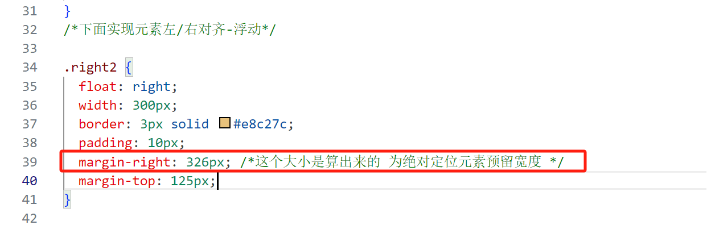
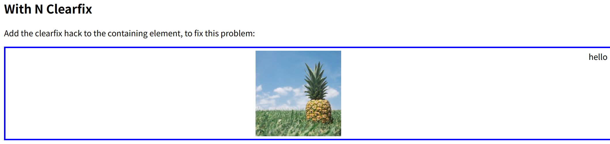
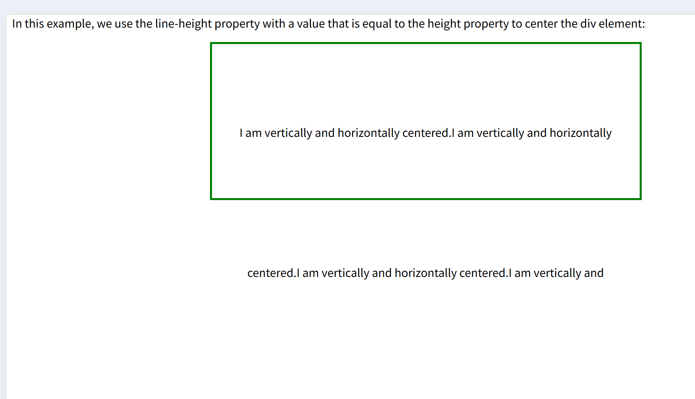

## 元素水平居中

```
  margin: auto;
  width: 50%;
  border: 3px solid green;
  padding: 10px;
```

元素需是块级元素（如 div、p），或通过 display: block / display: inline-block 转换为块级。

明确的宽度：width 需为具体值（如 80%、500px 等），**不能为 auto 或 100%**。

width: 50% 的必要性
为元素指定一个固定宽度（或百分比宽度），使得左右外边距有空间可以被 auto 分配。
若未设置宽度，元素宽度会默认占满父容器，此时 margin: auto 无效。

## 元素垂直居中-padding

```
<div class="center">
  <p>I am vertically centered.</p>
</div>
.center {
  padding: 70px 0;
  border: 3px solid green;
}
```

代码中 padding-left 和 padding-right 保持默认值 0，内容默认左对齐；
若需水平居中，需额外操作（如 text-align: center 或 margin: 0 auto），**而非依赖 padding-left 和 padding-right**。

## line-height 实现垂直居中

## 文本水平居中

```
text-align:center
```

## 图片水平居中

img 标签本身是行内元素，需要先转换成块元素再按照块元素方法实现居中

```
img {
display: block;
margin-left: auto;
margin-right: auto;
}
```

## 左右对齐-absolute 属性

right: 0px 的核心逻辑
右边缘对齐：right: 0px 表示元素的右边缘与其定位基准(z 这里基准是视窗 viewport)的右边缘重合，从而实现右对齐。

配合 width 使用：需设置 width（如 300px）以限制元素宽度。若无宽度约束，元素可能因默认宽度占满父容器而无法右对齐。

## 左右对齐-float 属性

```
.right {
float: right;
width: 300px;
border: 3px solid #73AD21;
padding: 10px;
}
```

### 同时使用两种方式的右对齐 absolute 属性和 float 属性，结果是两个元素出现了覆盖，原因是？

原因:1).right（绝对定位）：脱离文档流，不占据空间 → .right2 会认为页面有足够的空间向右浮动，但实际上 .right 已经占用了右侧位置。

2).right2（浮动）：尝试紧贴父容器右侧浮动，但未感知到 .right 的存在（因为绝对定位元素不占据空间），导致两者在右侧重叠。

解决：


## 解决父容器因包含浮动元素导致的高度塌陷问题-伪元素。

通过.clearfix::after 伪元素 和 清除浮动 的机制，强制父容器包裹浮动元素，恢复正确的布局高度
.clearfix::after 的解决原理：
通过向父容器 末尾插入一个不可见的元素，并在此元素上清除浮动，迫使父容器计算所有子元素（包括浮动元素）的高度。

```
.clearfix::after {
  content: "";
  clear: both;
  display: table;
}
```

逐行解析代码：

content: "" 为伪元素 ::after 生成一个空内容（无实际显示内容）；
display: table 将伪元素显示为 表格（兼容性更好，也可用 display: block）。
clear: both 清除 左右两侧的浮动，确保伪元素位于所有浮动元素的下方。

最终效果：
父容器会计算到伪元素的高度（虽然伪元素本身无高度,但因为伪元素会在所有浮动元素的下方），从而包裹住所有浮动子元素。

## 解决父容器因包含浮动元素导致的高度塌陷问题-flex。

```
<div class="clearfix">
      
      hello
    </div>
.img2 {
  float: right;
}

.clearfix {
  display: flex;
}
div {
  border: 3px solid blue;
  padding: 5px;
}
```

上面代码的效果：


图片和文本**同行显示**：图片（固定宽度 170px）和文本 hello 作为 Flex 项，默认从左到右排列。
若父容器宽度远大于 170px + 文本宽度，浏览器会保留剩余空间，但默认不会分配（justify-content: flex-start）。
视觉效果：图片在左侧，文本紧跟在右侧，不会居中或右对齐。

## 单行文本垂直居中--- line-height

通过 line-height 与 height 相等 实现单行文本的垂直居中

```

.center {
line-height: 200px;
height: 200px;
border: 3px solid green;
text-align: center;
}
```

如果有多行文本，那此时每行的行高就是 200px，紊乱


## 多行文本垂直居中--- line-height

```

.center p {
  line-height: 1.5;
  display: inline-block;
  vertical-align: middle;
}
```

line-height:行高是当前字体大小的 1.5 倍，是一个动态的相对值。
display: inline-block：将 <p> 元素转换为内联块元素，使其可与其他内联元素或文本节点共享行框（Line Box）。
vertical-align: middle：在行框内，将内联块元素的垂直中点对齐到父元素的基线（Baseline）上方半个 x-height 的位置，从而实现近似居中。

## 垂直居中---使用位置和变换

## 垂直居中---Flexbox

你也可以使用 flexbox 来居中。不过要注意 IE10 及更早的版本不支持 flexbox。

.center {
display: flex;
justify-content: center;
align-items: center;
height: 200px;
border: 3px solid green;
}
