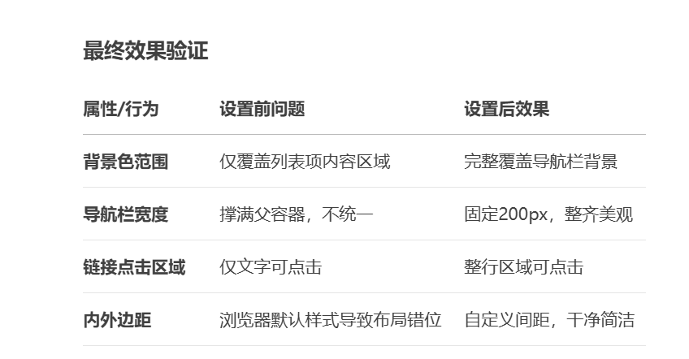
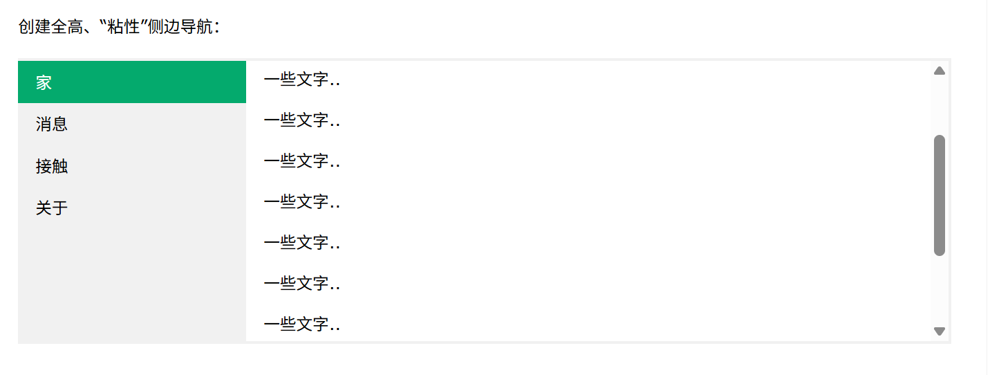

## 为什么 background-color 要放在 ul 而不是 li？

设计逻辑：导航栏的背景需要覆盖整个列表区域（包括所有 `<li>` 的排列范围）。

对比效果：

```
ul { background: #f1f1f1 }  /* 整个导航栏统一背景 */
/* vs */
li { background: #f1f1f1 }  /* 每个列表项单独背景，中间会有缝隙 */
```

结论：父容器 (ul) 设置背景色更合理。

## 内外边距的设置逻辑

ul 的 margin: 0; padding: 0;

原因：浏览器默认会给 `<ul>` 添加 padding-left（约 40px）和上下外边距，导致左侧留白和额外空间。

修复：清除默认样式，让导航栏紧贴容器边缘。

li a 的 padding: 8px 16px
作用：增加可点击区域（用户体验优化），让链接文字周围有呼吸空间。

调试技巧：如果删除 padding，文字会紧贴边缘，视觉效果拥挤。

## 为什么要给 ul 设置 width: 200px？

必要性：`<ul>` 是块级元素，默认宽度占满父容器。若不设固定宽度：

导航栏会横向撑满整个页面（失去垂直导航的紧凑感）

各菜单项宽度不一致（内容短的菜单项会看起来不统一）

替代方案：如果希望宽度自适应内容，可用 width: max-content;

## 为什么要把 `<a>` 设置为 display: block？

核心原因：`<a>` 默认是行内元素 (inline)，导致以下问题：

无法设置宽高：行内元素忽略 width/height

点击区域受限：只有文字部分可点击，空白区域无效

垂直对齐问题：多个行内元素默认基线对齐，可能参差不齐

设置为 block 后的优势：整个 `<li>` 区域都可点击,链接文字垂直居中更易控制

```
li a {
  display: block; /* 变成块级元素 */
  /* 现在可以自由设置宽高、内外边距 */
}
```

## 以上总结：



## 全高固定垂直导航栏

创建全高、“粘性”侧边导航：


```
ul {
  list-style-type: none;  /* 移除列表项前的默认符号（如圆点） */
  margin: 0;              /* 清除外部的默认边距 */
  padding: 0;             /* 清除内部的默认内边距 */
  width: 25%;             /* 导航栏宽度为视口宽度的25% */
  background-color: #f1f1f1; /* 背景颜色 */
  position: fixed;        /* 固定定位（脱离文档流） */
  height: 100%;           /* 高度撑满整个视口 */
  overflow: auto;         /* 内容溢出时显示滚动条 */
}
```
