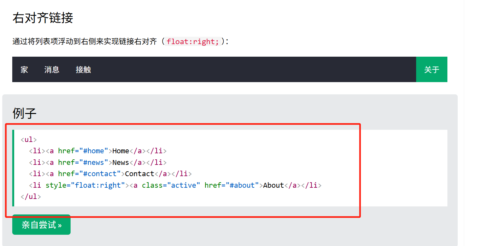
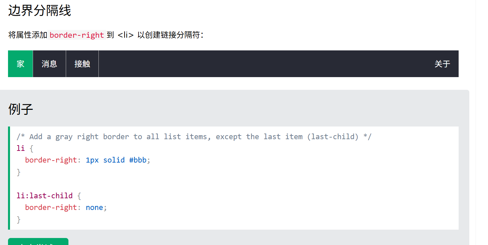
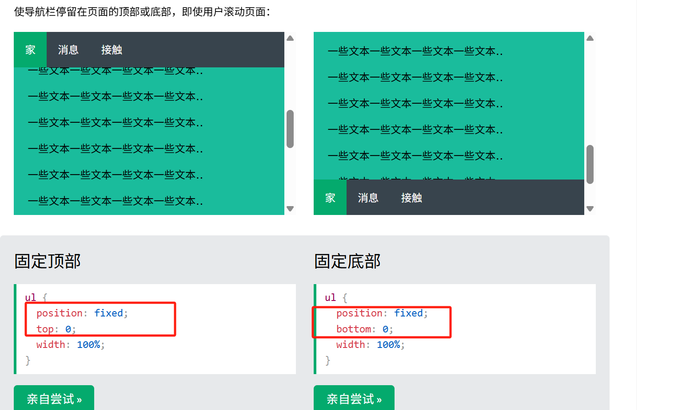
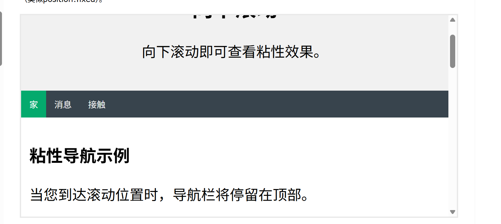
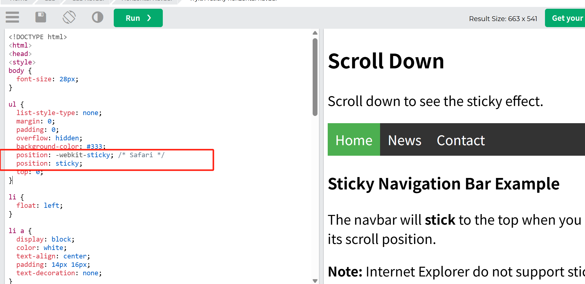

## 水平导航栏 = 链接列表

导航栏基本上是一个链接列表，因此使用 `<ul>` 和 `<li>` 元素非常有意义：

```
<ul>
  <li><a href="default.asp">Home</a></li>
  <li><a href="news.asp">News</a></li>
  <li><a href="contact.asp">Contact</a></li>
  <li><a href="about.asp">About</a></li>
</ul>
```

现在让我们从列表中删除项目符号、边距和填充：

```
ul {
  list-style-type: none;
  margin: 0;
  padding: 0;
}
```

list-style-type: none;- 删除项目符号。导航栏不需要列表标记
设置 margin: 0;和 padding: 0; 删除浏览器默认设置

## CSS 垂直导航栏

```
li a {
  display: block;
  width: 60px;
}
```

示例解释：

display: block;- 将链接显示为块元素使整个链接区域可点击（不仅仅是文本）
width: 60px;- 块元素默认占用全部可用宽度。

您还可以设置 <ul> 的宽度，并移除 <a> 的宽度，因为它们作为块元素显示时将占用全部可用宽度。这将产生与前面示例相同的结果：

```
ul {
  list-style-type: none;
  margin: 0;
  padding: 0;
  width: 60px;
}

li a {
  display: block;
}
```

## 水平导航栏

创建水平导航栏有两种方法：使用 内联或浮动列表项。

### 内联列表项

```
<ul>
  <li><a href="#home">Home</a></li>
  <li><a href="#news">News</a></li>
  <li><a href="#contact">Contact</a></li>
  <li><a href="#about">About</a></li>
</ul>
ul {
  list-style-type: none;
  margin: 0;
  padding: 0;
}

li {
  display: inline;
}
```

display: inline;- 默认情况下，<li> 元素是块元素。在这里，我们删除了每个列表项前后的换行符，以便将它们显示在一行上

### 浮动列表项

```
<ul>
  <li><a href="#home">Home</a></li>
  <li><a href="#news">News</a></li>
  <li><a href="#contact">Contact</a></li>
  <li><a href="#about">About</a></li>
</ul>
ul {
  list-style-type: none;
  margin: 0;
  padding: 0;
  overflow: hidden;  /*overflow: hidden：触发 BFC（块级格式化上下文），使父容器 <ul> 能包裹浮动的子元素 <li>，避免高度塌陷。*/
}

li {
  float: left;  /*- 使用浮动使块元素彼此相邻浮动*/
}

li a {
  display: block;
  padding: 8px;
  background-color: #dddddd;
}
```

## 右对齐链接



## 边界分隔线



## 固定导航栏



## 粘性导航栏

滑动导航栏到一定位置后导航栏才出现被固定，像被粘住一样
添加 position: sticky;到 <ul> 以创建粘性导航栏。


注意： Internet Explorer 不支持粘性定位。Safari 需要 -webkit- 前缀（参见上例）。您还必须至少指定 top 、right 或 bottom 中的一个才能使粘性 left 定位生效。
