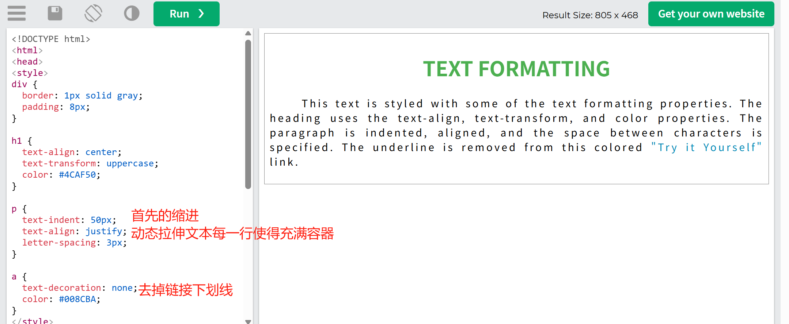
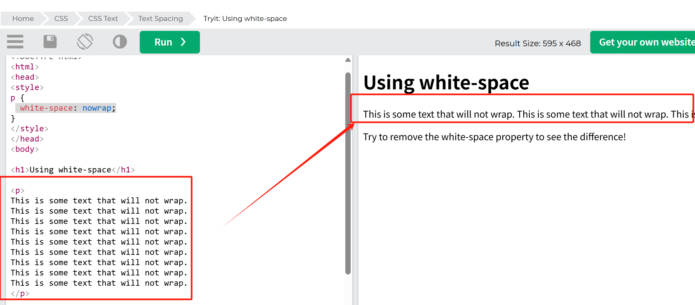

## 文本对齐

该 text-align 属性用于设置文本的水平对齐方式。

文本可以左对齐、右对齐、居中（center）或两端对齐（justify）。

```
h1 {
text-align: center;
}

h2 {
text-align: left;
}

h3 {
text-align: right;
}

```

**两端对齐，可以让文本每行有相等的宽度**



## 文本最后一行对齐

```
p.a {
text-align-last: right;
}

p.b {
text-align-last: center;
}

p.c {
text-align-last: justify;
}
```

## 文本方向 -倒放

```
p.ex1 {
  direction: rtl;             /* 设置文本方向为从右到左 */
  unicode-bidi: bidi-override; /* 强制覆盖字符的默认方向规则 */
}
```

## 文本转换

该 text-transform 属性用于指定文本中的大写和小写字母。

所有内容转换为大写

```
p.uppercase {
  text-transform: uppercase;
}
所有内容转换为小写
p.lowercase {
  text-transform: lowercase;
}
每个单词的首字母转换为大写
p.capitalize {
  text-transform: capitalize;
}
```

## 文本首行缩进

```
p {
  text-indent: 50px;
}
```

## 文本字母间距

该 letter-spacing 属性用于指定文本中字符之间的间距。

```
h2 {
  letter-spacing: 5px;
}

h3 {
  letter-spacing: -2px;
}
```

## 文本单词间距

该 word-spacing 属性用于指定文本中单词之间的间距。

```
p.one {
  word-spacing: 10px;
}

p.two {
  word-spacing: -2px;
}
```

## 文本行高

该 line-height 属性用于指定行之间的空间：

```
p.small {
  line-height: 0.7;
}

p.big {
  line-height: 1.8;
}
```

## 禁止文本换行

```
 white-space: nowrap;
```


