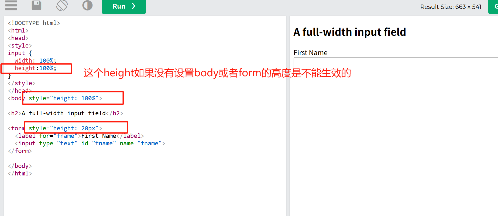
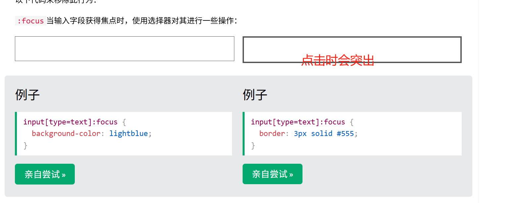
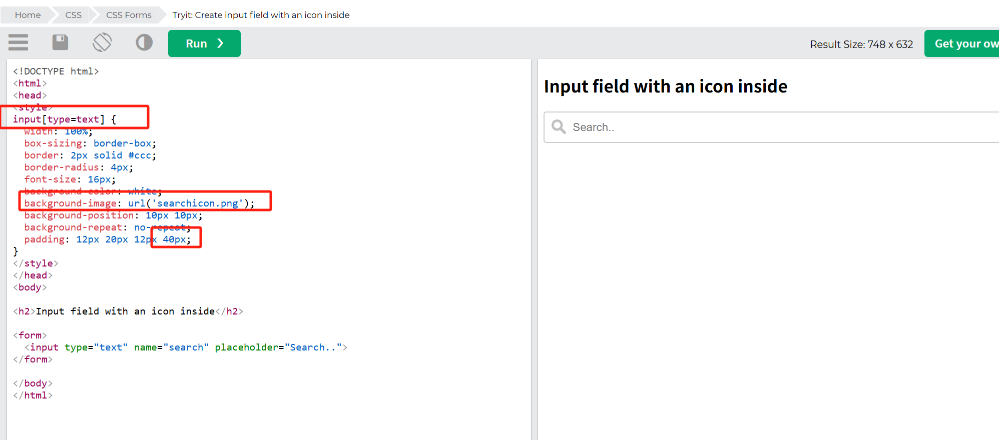
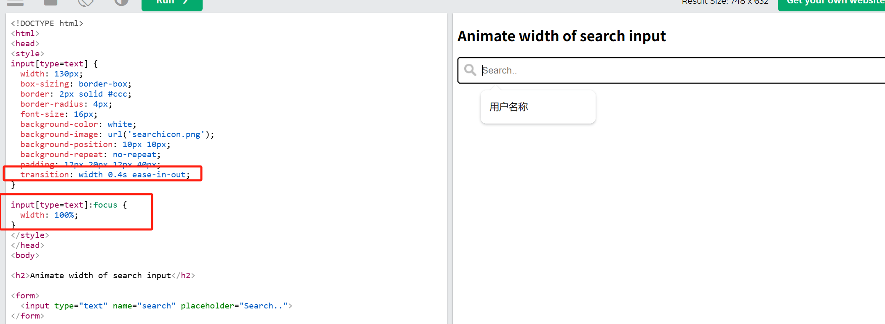
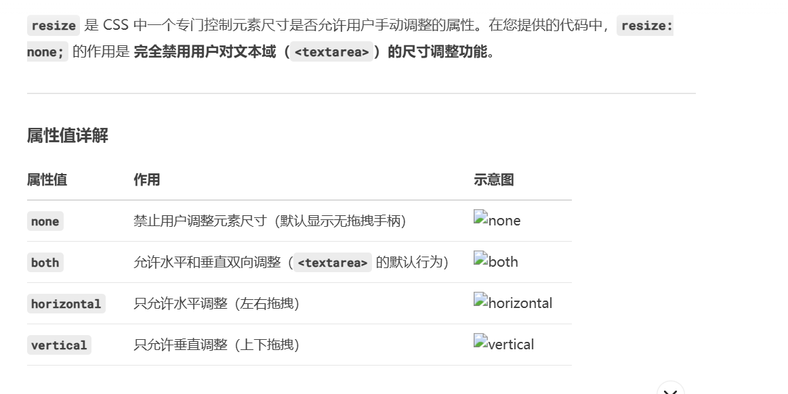

## `<label>` 的 for 属性和表单元素的 id 属性必须严格对应

注意，在 HTML 表单中，`<label>` 的 for 属性和表单元素的 id 属性必须严格对应，这是实现标签与表单控件关联的核心机制。

## input 输入框高度失效原因分析

百分比高度的计算规则
CSS 规范要求：元素的百分比高度需要父元素有 明确定义的高度 才能生效。在您的代码中：

`<input>` 的父级 `<form>` 没有设置高度

`<form>` 的父级 `<body>` 也没有设置高度

最终所有父级的高度都是 auto（由内容撑开）

## 重点输入

默认情况下，某些浏览器会在输入框获得焦点（点击）时在其周围添加蓝色轮廓。您可以通过 outline: none;在输入框中添加以下代码来移除此行为：

:focus 当输入字段获得焦点时，使用选择器对其进行一些操作：

## 图标填充

## 动画搜索输入

我们使用 CSStransition 属性来为搜索框获得焦点时的宽度添加动画效果。

## 样式化文本区域

使用该 resize 属性可防止文本区域被调整大小

