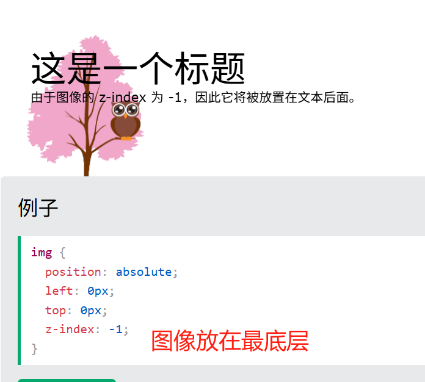

## z-index 属性

当元素被定位时，它们可以与其他元素重叠。

该 z-index 属性指定元素的堆栈顺序（哪个元素应放置在其他元素的前面或后面）。

元素可以具有正或负的堆栈顺序
z-index 仅仅适用于定位元素（位置：绝对、位置：相对、位置：固定或位置：粘性）和 Flex

注意：堆栈顺序较高的元素总是位于堆栈顺序较低的元素之上，如 z-index：3 的元素会位于 z-index：2 元素之前
