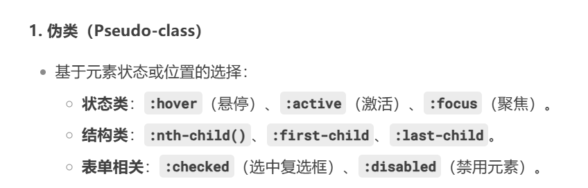

## 锚点伪类

```
/* unvisited link */
a:link {
  color: #FF0000;
}

/* visited link */
a:visited {
  color: #00FF00;
}

/* mouse over link */
a:hover {
  color: #FF00FF;
}

/* selected link  a:active 定义链接被点击瞬间的样式。 */

a:active {
  color: #0000FF;
}
```

注意： a:hover 必须位于 a:link a:visited 定义之后才能生效！
a:active 必须位于 a:hover 定义之后才能生效！伪类名不区分大小写。

## html 元素和伪类

```
/*下面是类选择器+伪类*/
.highlight:hover {
  color: #ff0000;
  font-size: 22px;
}
/*下面是元素选择器+伪类*/

div:hover {
  background-color: blue;
}

```

## 工具提示悬停

```
<div>
  Hover over this div element to show the p element
  <p>Tada! Here I am!</p>
</div>
p {
  display: none;          /* 默认隐藏 <p> 元素 */
  background-color: yellow;
  padding: 20px;
}

div:hover p {            /* 当鼠标悬停在 div 上时，显示其子元素 <p> */
  display: block;         /* 将 <p> 的显示模式改为块级元素 */
}
```

这里簇拥 p 标签是 div 标签的子元素

(1) display: none 的作用
隐藏元素：display: none 会完全从渲染树中移除元素，不占据任何空间。

对比其他隐藏方式：  
visibility: hidden：元素不可见，但仍占据空间。  
opacity: 0：元素完全透明，但可交互（如点击）。
这两种都不行，因为会一直保持被隐藏状态

## first-child 伪类

一。匹配第一个`<p>`元素

```
<body>
<p>This is some text1.</p>
<p>This is some text2.</p>
<div>
  <p>This is some text3.</p>
  <p>This is some text4.</p>
</div>
</body>
<style>
p:first-child {
  color: blue;
}
</style>
```

核心机制  
(1) :first-child 伪类的逻辑  
作用对象：
父元素的第一个子元素  
条件：
只有当第一个子元素与选择器指定的元素类型（如 p）匹配时，样式才会生效。

(2) 匹配过程  
第一个 p 标签（text1）：  
父元素：body  
找到 body 标签后第一个子 p 标签 匹配 p:first-child → 变蓝。

第三个 p 标签（text3）:  
父元素：div  
找到 div 标签后第一个子 p 标签 匹配 p:first-child → 变蓝。

其他 p 元素：不是其父元素的第一个子元素 → 不匹配，保持默认颜色。

二。匹配所有`<p>`元素中的第一个`<i>`元素

```
p i:first-child{
  样式
}
```

三。匹配所有第一个子 `<p>`元素中的所有 `<i>`元素

```
<body>

<p>I am a <i>strong</i> person. I am a <i>strong</i> person.</p>
<p>I am a <i>strong</i> person. I am a <i>strong</i> person.</p>

<div>
  <p>I am a <i>strong</i> person. I am a <i>strong</i> person.</p>
  <p>I am a <i>strong</i> person. I am a <i>strong</i> person.</p>
</div>

</body>
<style>
p:first-child i {
  color: blue;
}
</style>
```

匹配过程：
1）body 元素的第一个 p 标签中的所有 i 标签  
2）div 元素中的 p 标签中的所有 i 标签

## lang 伪类

```
<style>
q:lang(no) {
  quotes: "~" "~";
}
</style>
<body>

<p>Some text <q lang="no">A quote in a paragraph</q> Some text.</p>

</body>
```

这段代码通过 CSS 定制了特定语言环境下 `<q>` 标签的引号样式  
默认引号：`<q>` 标签内容通常显示为浏览器默认引号（如英文的 "..."）。

应用样式后：当 `<q>` 元素的 lang 属性设为 no（挪威语）时，引号变为 波浪号 ~...~


