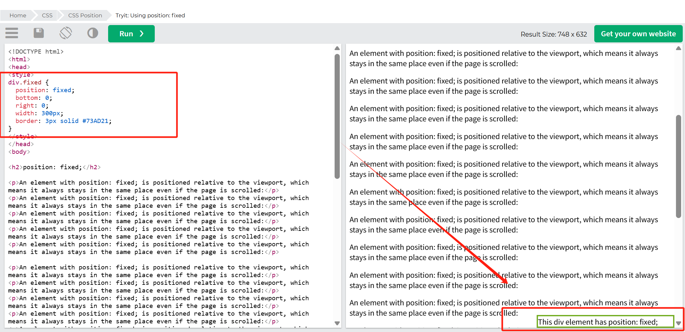
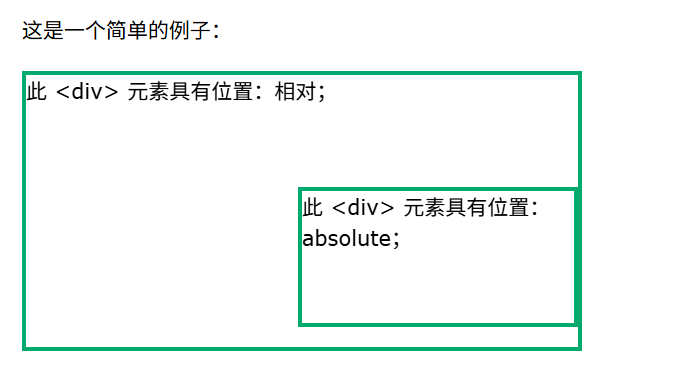
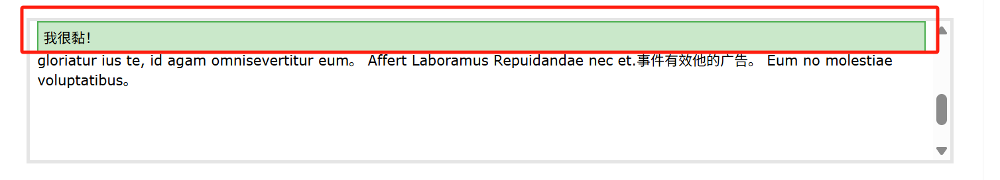

## 位置属性

position 属性指定元素使用的定位方法类型（静态、相对、固定、绝对或粘性）。
有五种不同的位置值：

- static
- relative
- fixed
- absolute
- sticky
  然后使用 top、bottom、left 和 right 属性对元素进行定位。但是，除非先设置 position 属性，否则这些属性不会起作用

## 位置 静态

```
div.static {
position: static;
border: 3px solid #73AD21;
}
```

HTML 元素默认定位是静态
静态定位元素不受顶部，底部，左侧和右侧属性影响

## 位置 相对

元素的 position: relative;定位是相对于其正常位置的。

设置相对定位元素的 top、right、bottom 和 left 属性将导致其偏离正常位置。

```
div.relative {
  position: relative;
  left: 30px;
  border: 3px solid #73AD21;
}
```

## 位置 固定

position: fixed;相对于视口进行定位，这意味着即使页面滚动，它始终停留在同一位置。top、right、bottom 和 left 属性用于定位元素。

```
div.fixed {
  position: fixed;
  bottom: 0;
  right: 0;
  width: 300px;
  border: 3px solid #73AD21;
}
```



## 位置 绝对

position: absolute;对于最近的定位祖先进行定位（而不是像固定那样相对于视口进行定位）。

但是，如果绝对定位元素没有定位祖先，它将使用文档主体，并随着页面滚动而移动。

```
div.relative {
  position: relative;
  width: 400px;
  height: 200px;
  border: 3px solid #73AD21;
}

div.absolute {
  position: absolute;
  top: 80px;
  right: 0;
  width: 200px;
  height: 100px;
  border: 3px solid #73AD21;
}
```



## 位置 粘性

粘性就相当于 excel 中的冻结

注意：您必须至少指定 top/right/bottom/left 中的一个,才能使粘性定位起作用。
