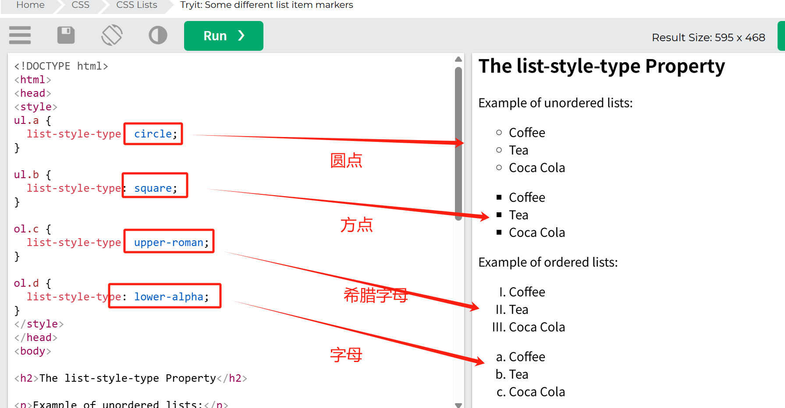

## 常见列表项标记

list-style-type 属性不同的列表项标记


## 图片作为列表项标记

```
ul {
list-style-image: url('sqpurple.gif');
}
```

## 定位列表项标记

```
ul.a {
list-style-position: outside;
}

ul.b {
list-style-position: inside;
}
```


## 删除默认标记项

删除默认设置

```
ul {
  list-style-type: none;
  margin: 0;
  padding: 0;
}
```

此 list-style-type:none 属性还可用于移除标记/项目符号。

请注意，列表还具有默认的边距和内边距。要移除这些，请将 margin:0 和 padding:0

## list-style ---简写属性

```
ul {
  list-style: square inside url("sqpurple.gif");
}
```

使用简写属性时，属性值的顺序为：

1.list-style-type（如果指定了列表样式图像，当图像由于某种原因无法显示时，将显示此属性的值）  
2.list-style-position（指定列表项标记是否应出现在内容流的内部或外部）  
3.list-style-image（指定图像作为列表项标记）
