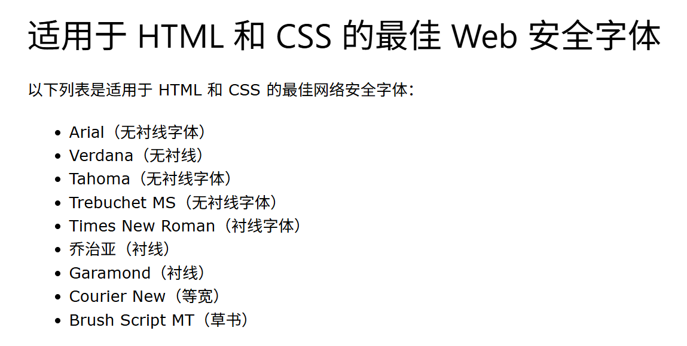
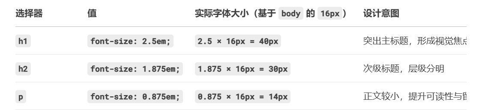
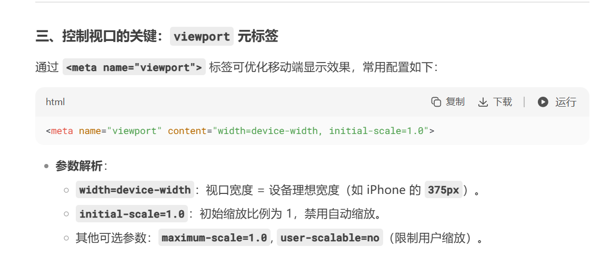
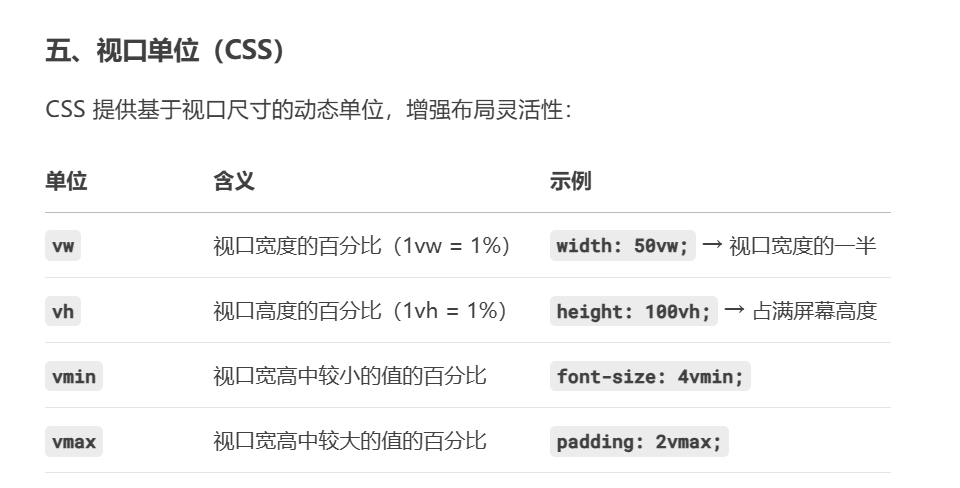
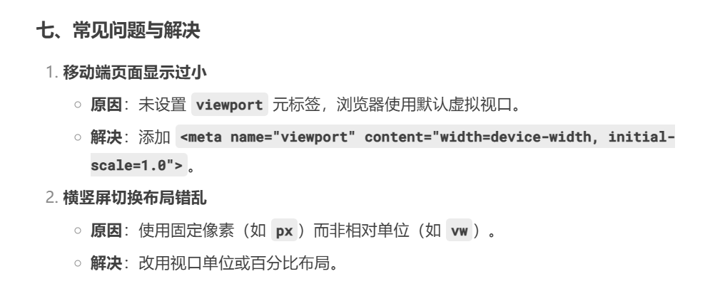

## 字体推荐



## 字体样式

该 font-style 属性主要用于指定斜体文本。
此属性有三个值：

- 正常 - 文本正常显示
- 斜体-文本以斜体显示
- 倾斜 - 文本“倾斜”（倾斜与斜体非常相似，但支撑较少）

```
p.normal {
  font-style: normal;
}

p.italic {
  font-style: italic;
}

p.oblique {
  font-style: oblique;
}
```

## 字体粗细

```
p.normal {
  font-weight: normal;
}

p.thick {
  font-weight: bold;
}
```

## 字体大小

**px 或者 em**
1em 等于当前字体大小。浏览器默认的文本大小是 16px。因此，1em 的默认大小就是 16px。

可以使用以下公式从像素到 em 计算尺寸：像素/16= em

**百分比**

```
body {
  font-size: 100%;
}

h1 {
  font-size: 2.5em;
}

h2 {
  font-size: 1.875em;
}

p {
  font-size: 0.875em;
}
```

基准设置：body { font-size: 100%; }
作用：将 <body> 的字体大小设置为浏览器默认值的 100%（通常为 16px）。
意义：

作为整个页面的字体基准，所有子元素的 em 单位将基于此值计算。

用户若调整浏览器默认字体大小，页面字体会按比例缩放，提升可访问性。


## 响应式字体大小

```
<h1 style="font-size:10vw">Hello World</h1>
```

视口 (Viewport) 是指浏览器窗口的大小。视口（Viewport）是用户在浏览器中实际看到的网页区域，它决定了网页内容如何在不同设备（如手机、平板、电脑）上显示和布局
1vw = 视口宽度的 1%。如果视口宽度为 50 厘米，则 1vw 为 0.5 厘米。




## 如何使用谷歌字体？

只需要在 head 标签内部添加 link,然后在 font-family(备用文字都放在这里)添加就行

```
<head>
<link rel="stylesheet" href="https://fonts.googleapis.com/css?family=Sofia">
<style>
body {
  font-family: "Sofia", sans-serif;
}
</style>
</head>

```

如果要请求多种字体，只需要添加分隔符|,但是可能会让网页变卡

```
<link rel="stylesheet" href="https://fonts.googleapis.com/css?family=Audiowide|Sofia|Trirong">
```

## font 字体属性简写

该 font 属性是以下属性的简写：

- font-style
- font-variant
- font-weight
- font-size/line-height
- font-family
  注意：和 font-size 是 font-family 必需的。如果缺少其中一个值，则使用其默认值。

```
  p.b {
  font: italic small-caps bold 12px/30px Georgia, serif;
}
```

作用：  
字体样式：italic（斜体）  
字体变体：small-caps（小写字母显示为小型大写字母）  
字重：bold（粗体）

字体大小/行高：12px/30px（字体大小 12px，行高 30px)  
字体系列：优先用 Georgia，若无则用系统默认衬线字体（如 Times New Roman）。
