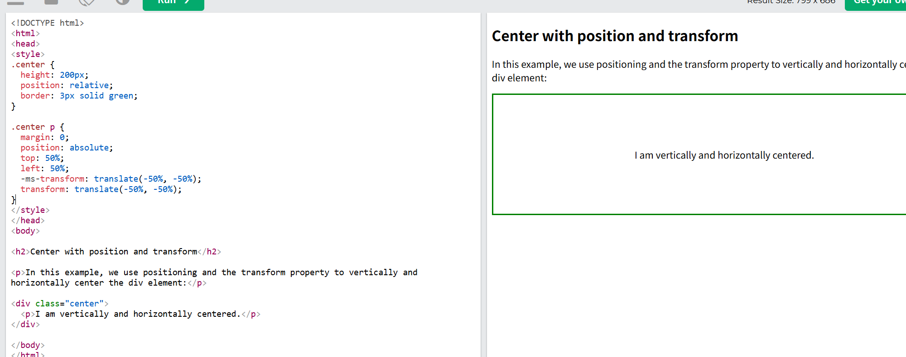

## 居中对齐元素

要水平居中块元素（如 `<div>`）， 1.设置宽度 2.使用 margin: auto;

```
.center {
  margin: auto;
  width: 50%;
  border: 3px solid green;
  padding: 10px;
}
```

设置元素的宽度将防止其延伸到其容器的边缘。
设置完元素宽度后元素将占据指定的宽度，剩余空间将在两个边距之间平均分配
**注意：width 如果未设置该属性（或设置为 100%），则居中对齐无效。**

## 居中对齐文本

要将文本置于元素的中心，请使用 text-align: center;

## 图像居中

```
img {
  display: block;
  margin-left: auto;
  margin-right: auto;
  width: 40%;(可以不设)
}
```

## 元素左右对齐-使用绝对位置

1.设置 position 2.设置左还是右

```
.right {
  position: absolute;
  right: 0px;
  width: 300px;
  border: 3px solid #73AD21;
  padding: 10px;
}
```

## 元素左右对齐-使用浮动

```
.right {
  float: right;
  width: 300px;
  border: 3px solid #73AD21;
  padding: 10px;
}
```

## 解决浮动溢出问题--Clearfit Hack

如果一个元素的高度高于包含它的元素，并且该元素是浮动的,它将溢出其容器。您可以使用“clearfix hack”来解决这个问题

```
.clearfix::after {
  content: "";
  clear: both;
  display: table;
}
```

**什么时候用？**
当父元素包裹着很多会"漂浮"的子元素（比如用了 float 的图片或区块）时，父元素会以为自己是空的，导致布局错乱。这时给父元素加上 class="clearfix"，

## 垂直居中-使用填充

使用 padding 使元素的内容上边和下边相等

```
.center {
  padding: 70px 0;
  border: 3px solid green;
}
```

## 垂直居中-line-height

1.line-height 和 height 值相等，此时文本行会会撑满整个容器的高度，自然垂直居中。 2.局限：只适用于单行文本（如果文本换行，第二行会溢出容器）。需要固定容器高度（这里是 200px）。

```
<!DOCTYPE html>
<html>
<head>
<style>
.center {
  line-height: 200px;
  height: 200px;
  border: 3px solid green;
  text-align: center;
}

.center p {
  line-height: 1.5; /*表示行高是当前字体大小的1.5倍*/
  display: inline-block;/*将 <p> 设置为 inline-block 后，它会像文本一样跟随父容器的 text-align: center 水平居中*/
  vertical-align: middle;/*则微调 <p> 块在父容器行高内的垂直位置，使其更精确居中*/
}
</style>
</head>
<body>

<h2>Center with line-height</h2>

<p>In this example, we use the line-height property with a value that is equal to the height property to center the div element:In this example, we use the line-height property with a value that is equal to the height property to center the div element:</p>

<div class="center">
  <p>I am vertically and horizontally centered.I am vertically and horizontally centered.I am vertically and horizontally centered.I am vertically and horizontally centered.I am vertically and horizontally centered.I am vertically and horizontally centered.</p>
</div>

</body>
</html>

```

**为什么需要结合 display: inline-block 和 vertical-align: middle？**

父容器通过 line-height: 200px 实现了垂直居中，但实际内容是一个 <p> 元素（块级元素），默认会占据整行，破坏居中效果。

将 `<p>` 设置为 inline-block 后，它会像文本一样跟随父容器的 text-align: center 水平居中。

vertical-align: middle 则微调`<p>`块在父容器行高内的垂直位置，使其更精确居中。

## 垂直居中-使用位置和变换

使用定位和 transform 属性

父元素起到一个定位作用，如果没有 position: relative;
那么子元素会以文档为定位基准。
对子元素：
1.position: absolute; /_ 关键：脱离文档流，相对于父容器定位 _/
2.top: 50% 让子元素的顶部边缘对齐到父容器垂直中点。
3.left: 50% 让子元素的左侧边缘对齐到父容器水平中点。 4.反向位移自身尺寸的 50%，transform: translate(-50%, -50%) 将子元素向左移动自身宽度的 50%，向上移动自身高度的 50%。这会让子元素的中心点对齐到父容器的中心点，实现完美居中。

## 垂直居中-使用 flexbox

```
.parent {
  display: flex;              /* 启用 Flexbox 布局 */
  justify-content: center;    /* 水平居中 */
  align-items: center;        /* 垂直居中 */
  height: 200px;              /* 明确父容器高度（必须） */
  border: 2px solid green;
}
```

核心属性作用
display: flex 将父容器设为 Flex 容器，**子元素默认成为 Flex 项目（按行排列）**。开启 Flex 布局后，子元素的 float、clear、vertical-align 等属性失效。

justify-content: center 控制 主轴（默认水平方向） 的对齐方式，center 表示子元素水平居中。

align-items: center 控制 交叉轴（默认垂直方向） 的对齐方式，center 表示子元素垂直居中。
