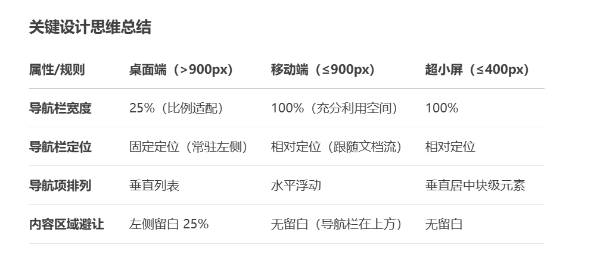
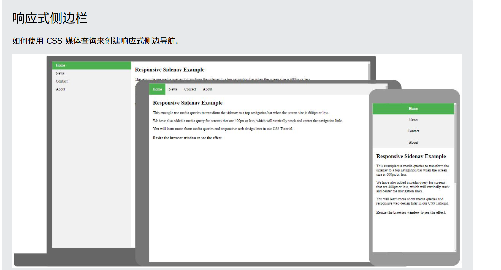

## 为什么侧边栏设 width:25%?

- 作用：在桌面端让侧边栏占据屏幕宽度的 25%，留出 75% 给内容区域。

- 对比：
  若设为固定值（如 300px），在小屏幕上可能过宽；百分比单位保证布局比例适配不同屏幕尺寸。

- 示例：
  在 1200px 宽度的屏幕上，侧边栏宽度为 300px，内容区域为 900px。

## 为什么侧边栏定位 position:fixed?

- 作用：固定侧边栏位置，滚动页面时导航栏始终可见。

- 对比：
  若用 position: absolute 或默认 static，导航栏会随页面滚动消失，失去快速导航功能。

- 典型场景：长页面中保持导航栏常驻左侧。

## 为什么侧边栏 height: 100%;（侧边栏高度）？

- 作用：让侧边栏撑满整个视口高度，与内容区域高度一致。

- 对比：
  若设为 auto，侧边栏高度仅由内容决定，短内容时下方会出现空白。

## 为什么 overflow: auto; 能否换为 hidden？

- 区别：

auto：内容溢出时显示滚动条（如导航项过多时仍可滚动访问）。

hidden：直接隐藏溢出内容，可能导致部分导航项不可见。

- 建议：优先保留 auto 保证功能完整性。

## 为什么 div.content { margin-left: 25%; }？

- 作用：为固定定位的侧边栏腾出空间，防止内容被导航栏遮挡。

- 对比：
  若不设置，内容会从屏幕左侧开始显示，与侧边栏重叠。

## 6. padding: 1px 16px;（内容区域内边距）?

## 7. height: 1000px;（内容区域高度）

目的：模拟长页面效果，展示侧边栏固定定位时内容滚动的交互。

实际开发：通常由真实内容撑开高度，此处为演示临时设置。

## 8. 媒体查询 max-width: 900px 中的样式?

- width: 100%：让导航栏占满屏幕宽度，适应中屏幕设备（如平板）。

- height: auto：高度由内容决定（水平导航不需要全屏高度）。

- position: relative：解除固定定位，让导航栏跟随文档流排列在内容上方。

- 对比桌面布局：
  从垂直侧边栏 → 水平顶部导航栏，提升小屏幕操作体验。

## 10. 媒体查询 max-width: 400px 中 float: none？

作用：在小屏幕上取消浮动，让导航链接恢复为块级元素垂直堆叠。

对比中屏幕：
中屏幕（≤900px）水平导航 → 超小屏幕（≤400px）垂直居中导航，避免横向排列拥挤。

用户体验优化：
手指点击更精准，避免误触。

## 设计思路

## 效果

