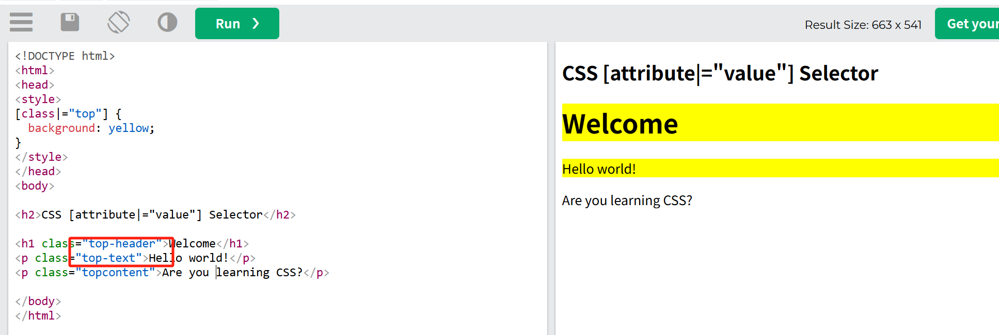

## 使用特定属性设置 html 元素样式

## CSS [属性] 选择器

以下用于选择具有指定属性的元素。

## CSS [attribute="value"] 选择器

以下用于选择具有指定属性和值的元素。

## CSS [attribute~="value"] 选择器

以下用于选择属性值包含指定单词的元素。

## CSS [属性|="值"] 选择器

以下用于选择具有指定属性的元素，其值可以正好是指定的值，或者是指定值后跟连字符（-）。

## CSS [attribute^="value"] 选择器

以下用于选择具有指定属性的元素，其值以指定的值开头。

## CSS [attribute$="value"] 选择器

以下用于选择属性值以指定值结尾的元素。

## CSS [attribute*="value"] 选择器

以下用于选择属性值包含指定值的元素。

## 样式表单

属性选择器对于没有类或 ID 的表单样式很有用：

