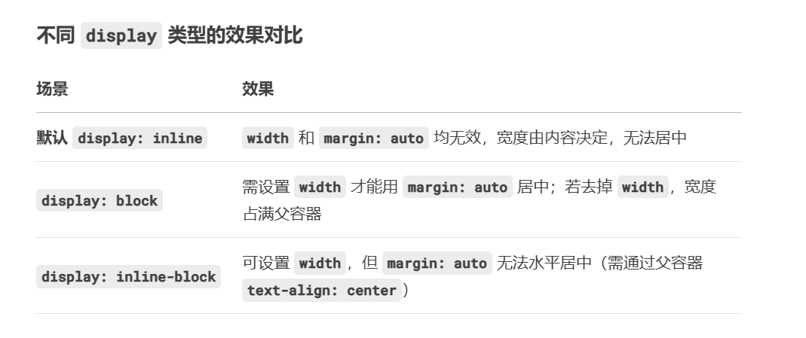
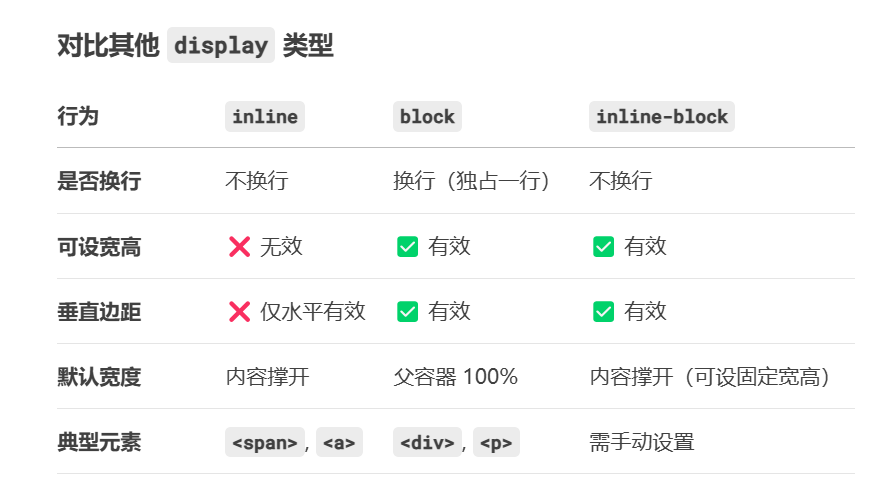

## Display 属性

- 该 display 属性用于指定元素在网页上的显示方式。

- 每个 HTML 元素都有一个默认显示值，具体取决于元素的类型。大多数元素的默认显示值为 block 或 inline。

- 该 display 属性用于改变 HTML 元素的默认显示行为。

## Block

- div
- h1-h6
- p
- form
- header
- footer
- section

## Inline

- span
- a
- img

## 显示：无

display: none;

## 隐藏元素 - display:none 还是 visibility:hidden？

前者不占据空间，  
后者占据空间。不会影响布局

