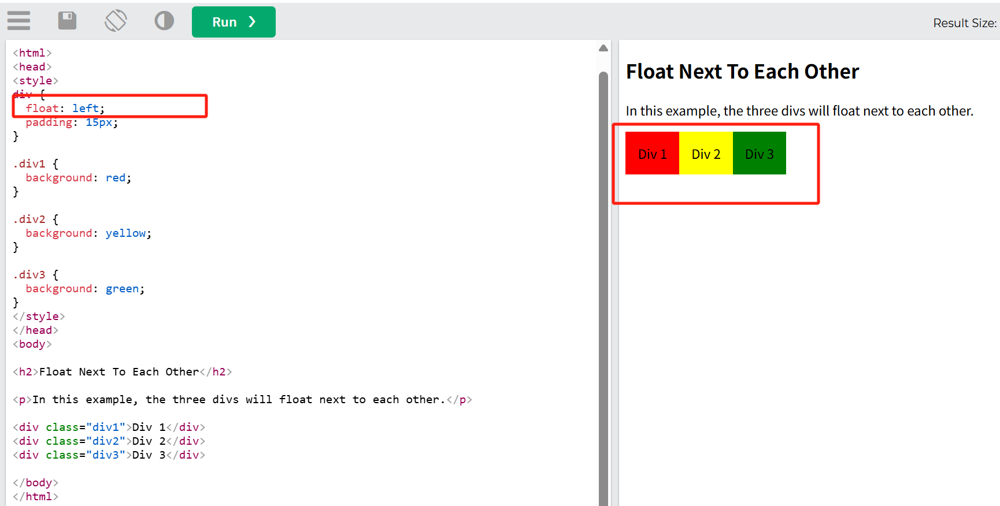
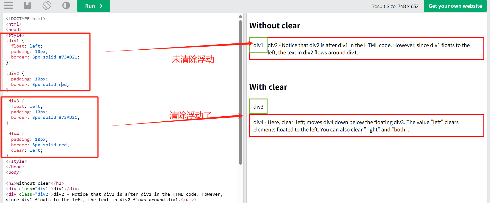
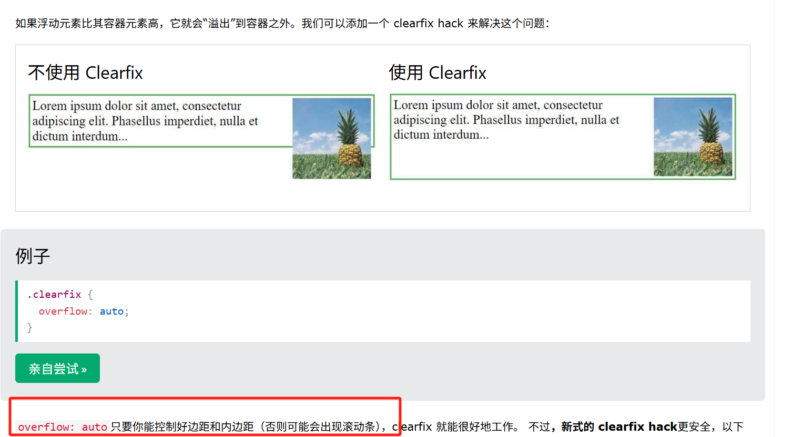
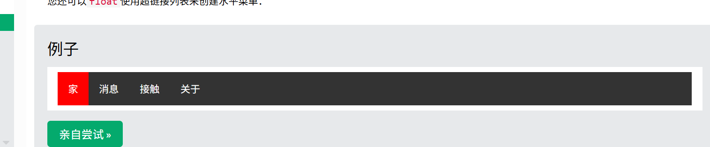

## 浮动

float 属性指定元素如何浮动。
该 float 属性可以具有下列值之一：

- left- 元素浮动到其容器的左侧
- right- 元素浮动到其容器的右侧
- none- 元素不浮动（将显示在文本中出现的位置）。这是默认设置
- inherit- 该元素继承其父元素的浮点值

## 浮动相邻

通常情况下，div 元素会显示在彼此的上方。但是，如果我们使用 div ，float: left/right 我们可以让元素彼此浮动：



## 清除

使用 clear 强制元素换行，避免与浮动元素重叠。
当我们使用该 float 属性时，我们想要下面的下一个元素（不在右边或左边），我们将必须使用该 clear 属性。

该 clear 属性指定浮动元素旁边的元素应发生什么。

- none- 元素不会被推到左浮动元素或右浮动元素下方。这是默认设置
- left- 该元素被推到左浮动元素下方
- right- 该元素被推到右浮动元素下方
- both- 该元素被推到左浮动元素和右浮动元素的下方
- inherit- 该元素从其父元素继承了明确的值
  

## Clearfit hack

如果浮动元素比其容器元素高，它就会“溢出”到容器之外。我们可以添加一个 clearfix hack 来解决这个问题：

```
.clearfix {
  overflow: auto;
}
```



## 最推荐

```
.clearfix::after {
  content: ""; /*生成伪元素内容*/
  clear: both;/*清除左右两侧浮动影响*/
  display: table;/*将伪元素显示为表格（触发BFC）*/
}
这段代码作用是 使父容器强制正确包裹住子元素，避免布局异常
```

## 清除浮动的三种方法：

1. 父元素触发 BFC（推荐 ⭐️）
   方法：给父元素设置以下任一属性：（任一！任一！）

```
css
方法1 overflow: hidden;   /* 最常用 */
方法2display: inline-block;
方法3float: left;        /* 父元素自己也浮动 */
原理：BFC 会强制计算浮动元素的高度。
```

2. 伪元素清除法（.clearfix 经典方法）

```
css
.clearfix::after {
  content: "";
  display: block;  /* 或 table */
  clear: both;
}
原理：在父元素末尾插入隐形块级元素，强制父元素包裹浮动内容。
```

5. 使用现代布局替代浮动（终极方案 🌟）
   用 Flexbox 或 Grid 布局代替浮动，天然避免高度塌陷：

```
css
ul {
  display: flex; /* 弹性盒子布局 */
}
```

## 通过 float 创建导航菜单



```
ul {
  list-style-type: none;
  margin: 0;
  padding: 0;
  overflow: hidden;
  background-color: #333;
}

li {
  float: left;
}

li a {
  display: inline-block;
  color: white;
  text-align: center;
  padding: 14px 16px;
  text-decoration: none;
}

li a:hover {
  background-color: #111;
}

.active {
  background-color: red;
}


<ul>
  <li><a href="#home" class="active">Home</a></li>
  <li><a href="#news">News</a></li>
  <li><a href="#contact">Contact</a></li>
  <li><a href="#about">About</a></li>
</ul>
```

## Flexbox 创建弹性框

```
<div class="flex-container">
  <div class="box">Box 1 - This is some text to make sure that the content gets really tall. This is some text to make sure that the content gets really tall.</div>
  <div class="box">Box 2 - My height will follow Box 1.</div>
</div>

<style>
/*将父元素设置成弹性框*/
.flex-container {
  display: flex;
  flex-wrap: nowrap;
  background-color: DodgerBlue;
}

.flex-container .box {
  background-color: #f1f1f1;
  width: 50%;
  margin: 10px;
  text-align: center;
  line-height: 75px;
  font-size: 30px;
}
</style>

```

## 清除浮动方法总结

- 1.空 div 法

```
<div class="parent">
  <div class="float-child"></div>
  <div style="clear: both;"></div> <!-- 空div -->
</div>
```

- 2.伪元素清除法（推荐）

```
.parent::after {
  content: "";
  display: block; /* 或 table */
  clear: both;
}
```

- 3.Overflow 触发 BFC

```
.parent {
  overflow: hidden; /* 或 auto */
}
```

- 4. Flexbox / Grid 布局

```
.parent {
  display: flex; /* 或 grid */
}
```
