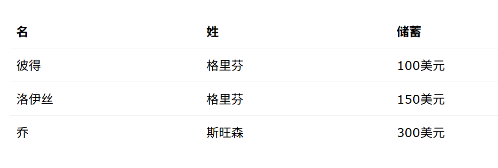
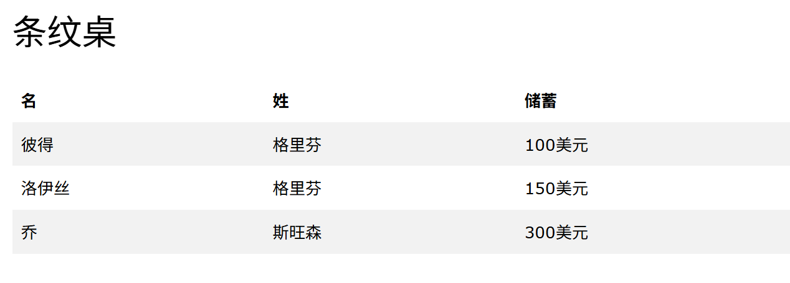
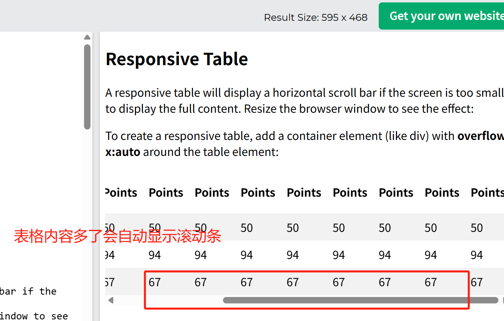

## 折叠表格边框

当表格以及 <th> 和 <td> 元素都有单独的边框(border)。

要删除双边框：

```
table {
  border-collapse: collapse;
}
```

## 表大小

table { width: 100%; } 让表格宽度自适应父容器，是响应式设计的常用技巧。

## CSS 表格对齐

**水平对齐**
属性：text-align
属性值：left,right,center

```
td {
  text-align: center;
}
```

**垂直对齐**
属性：vertical-align
属性值：top,bottom,center

```
td {
  height: 50px;
  vertical-align: bottom;
}
```

## 表水平分隔线

```
th, td {
  padding: 8px;
  text-align: left;
  border-bottom: 1px solid #ddd;
}
```



## 悬停表

当鼠标悬停在某一行时，改行会改变颜色
tr:hover {background-color: coral;}

## 条纹桌

对于斑马条纹表，使用选择器并向所有偶数表行 nth-child()添加：background-color

```
tr:nth-child(even) {background-color: #f2f2f2;}
```



## 响应式表格

如果屏幕太小而无法显示全部内容，通过响应式表格将显示水平滚动条：
可在 `<table>` 元素周围添加一个容器元素（如 `<div>`）overflow-x:auto 以使其具有响应性：

```
<div style="overflow-x: auto;">
  <table>
    <tr>
----
    </tr>
    <tr>
----
    </tr>

  </table>
  </div>
```


数据多了会自动显示滚动条，数据少了滚动条消失

## 表格的其他属性

- border-spacing：当 border-collapse: separate 时，定义相邻单元格边框之间的间距。
- caption-side
  作用：控制表格标题（<caption>）的垂直位置。可选值：top/bottom
- empty-cells
  作用：
  控制空单元格是否显示边框和背景。可选值：show/hide

- table-layout
  作用：
  设置表格的布局算法，控制列宽的分配方式。可选值：auto/fixed,经常在需要固定列宽或提升大型表格渲染性能的场景使用。
