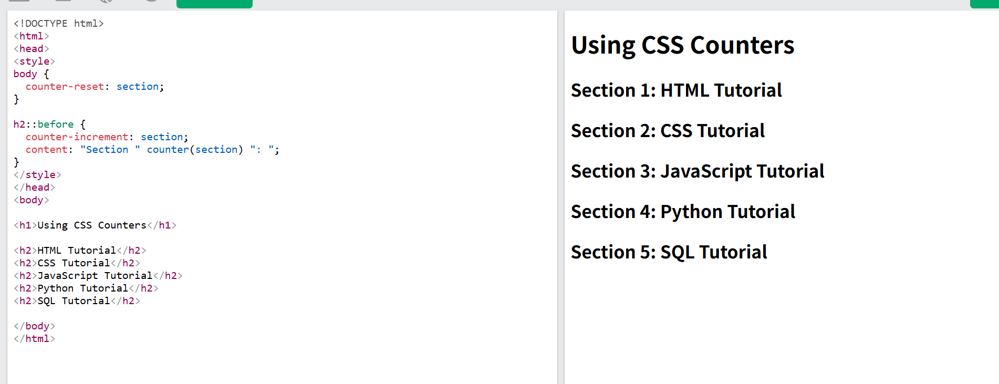
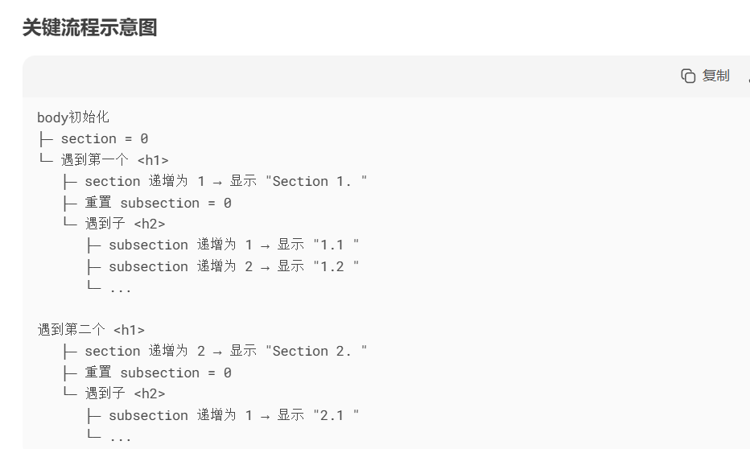

## 使用计数器自动编号

- counter-reset- 创建或重置计数器
- counter-increment- 增加计数器值
- content- 插入生成的内容
- counter()或 counters()函数 - 将计数器的值添加到元素

## 计数器核心机制


**计数器初始化**

```
body {
  counter-reset: section; /* 创建名为 section 的计数器，初始值 0 */
}


默认初始值为 0（可设置初始值：counter-reset: section 5;）
```

**计数器递增与内容插入**

```
h2::before {
counter-increment: section; /_ 每次遇到 h2 时 section 计数器 +1 _/
content: "Section " counter(section) ": "; /_ 插入文本 _/
}
counter-increment：触发计数器递增
content：通过 counter() 函数获取当前计数器值
```

## 嵌套计数器



## 计数器做大纲列表

这里我们使用该 counters()函数在不同级别的嵌套计数器之间插入一个字符串：

例子
