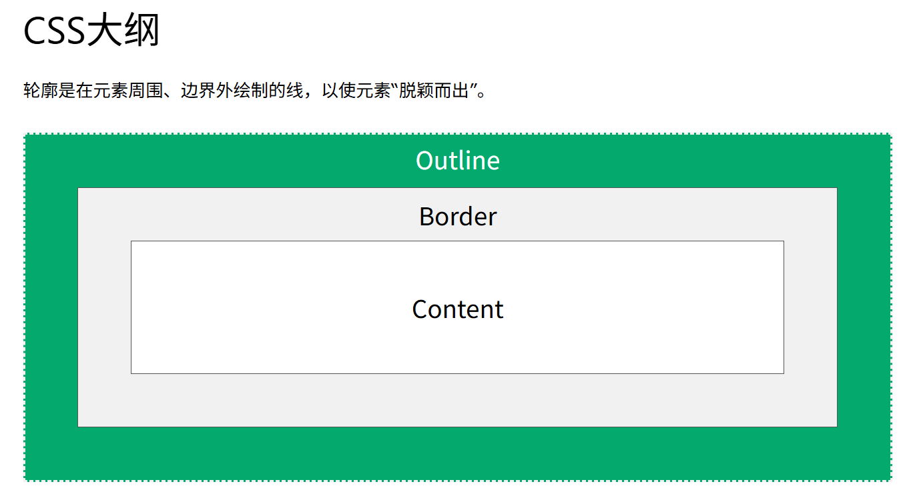
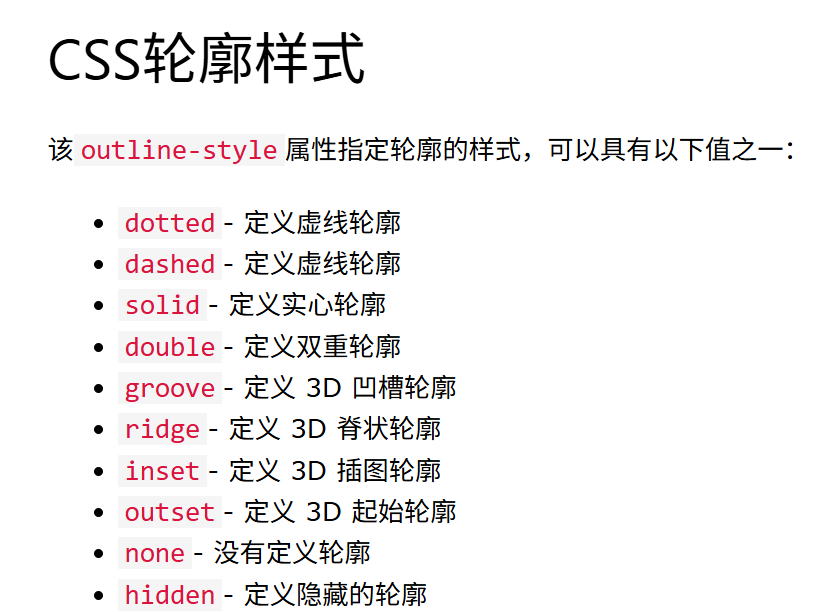
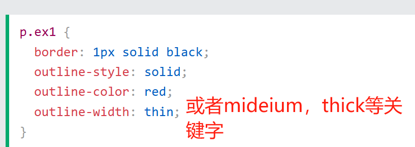
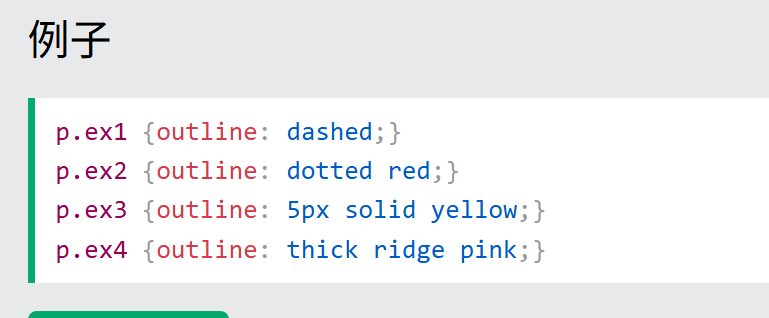

## 轮廓属性


CSS 具有以下轮廓属性：

- outline-style
- outline-color
- outline-width
- outline-offset
- outline
  注意：轮廓与边框不同！与边框不同，轮廓绘制在元素边框之外，并且可能与其他内容重叠。此外，轮廓不属于元素尺寸的一部分；元素的总宽度和高度不受轮廓宽度的影响。

## 轮廓样式





## 轮廓 属性简写

该 outline 属性是用于设置以下各个轮廓属性的简写属性：

- outline-width
- outline-style（必需的）
- outline-color
  

## 轮廓偏移

```
p {
margin: 30px;
border: 1px solid black;
outline: 1px solid red;
outline-offset: 15px;
}
```

如果没有属性 outline-offset，那么轮廓和 border 是重叠在一起的
