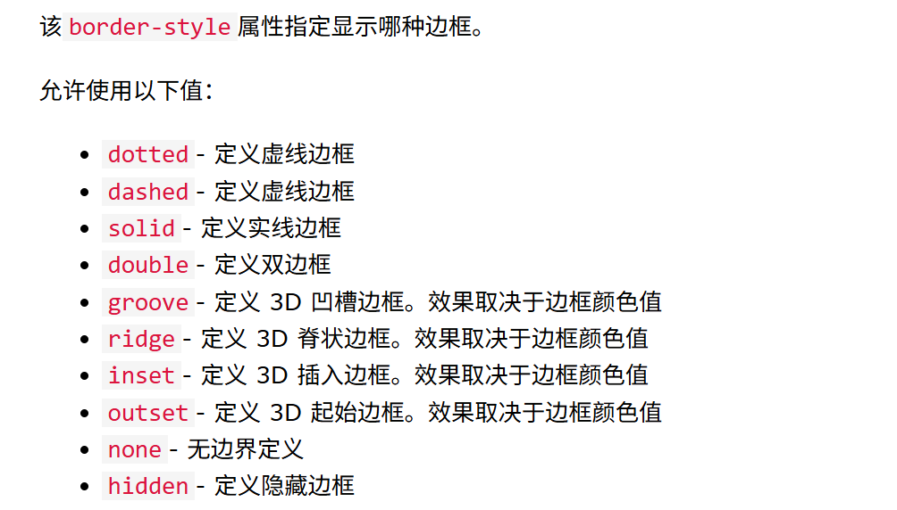
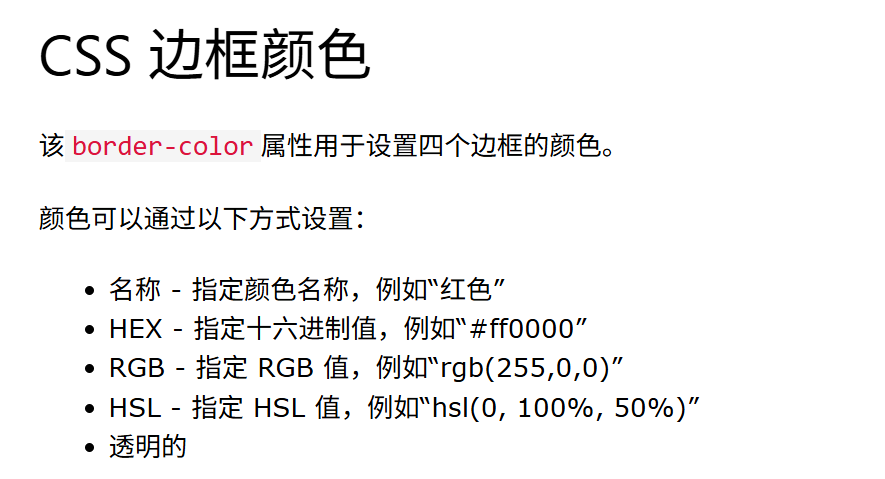

## 边框样式



## 边界边

CSS 的 border-style 属性确实可以接受 1 到 4 个值

```
1 个值：统一所有边框
.box {
  border-style: dashed; /* 四个边均为虚线 */
}
2 个值：上下 vs 左右

.box {
  border-style: solid double; /* 上下实线，左右双线 */
}
3 个值：上 / 左右 / 下
.box {
  border-style: groove ridge inset; /* 上凹槽，左右脊线，下内嵌 */
}
4 个值：独立设置各边
.box {
  border-style: dotted solid double none; /* 上点线，右实线，下双线，左无边框 */
}
```

也可以单独设置单边

```
.box {
  border-top-style: dotted;    /* 仅上边框点线 */
  border-right-style: groove;  /* 仅右边框凹槽 */
}
```

## 边框宽度

border-width

## 边框颜色



```
/*下面是十六进制*/
p.one {
  border-style: solid;
  border-color: #ff0000; /* red */
}
/*下面是RGB*/
p.one {
  border-style: solid;
  border-color: rgb(255, 0, 0,0.5);  /*0.5是透明度 */
}
/*下面是HSL*/
p.one {
  border-style: solid;
  border-color: hsl(0, 100%, 50%); /* red */
}
```

## 边框简写 （常用）

border 属性是以下各个边框属性的简写属性：

- border-width
- border-style（必需的）
- border-color

```
p {
  border: 5px solid red;
}
```

您还可以仅为一侧指定所有单独的边框属性：

```
p {
  border-left: 6px solid red;
}
```

## 圆角边框

```
p {
  border: 2px solid red;
  border-radius: 5px;
}
```
